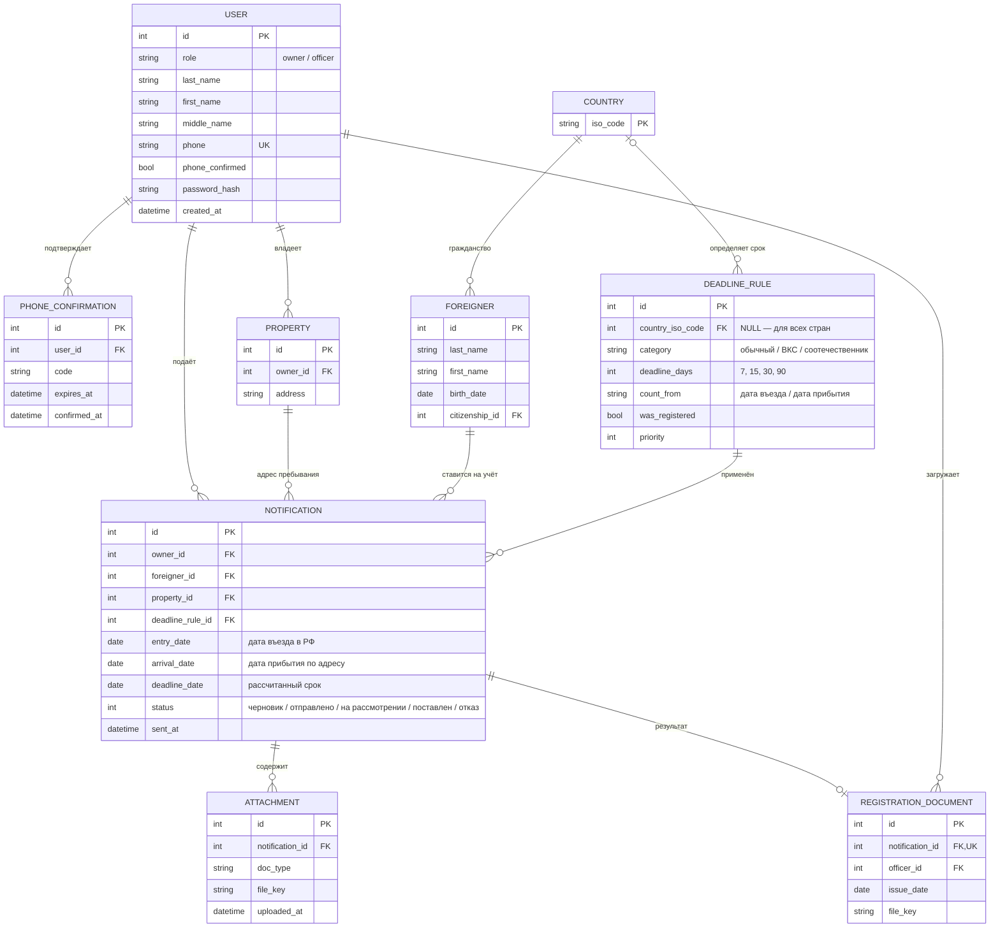

```mermaid
erDiagram
    USER {
        int id PK
        string role "owner / officer"
        string last_name
        string first_name
        string middle_name
        string phone UK
        bool phone_confirmed
        string password_hash
        datetime created_at
    }

    PHONE_CONFIRMATION {
        int id PK
        int user_id FK
        string code
        datetime expires_at
        datetime confirmed_at
    }

    PROPERTY {
        int id PK
        int owner_id FK
        string address
    }

    COUNTRY {
        string iso_code PK
    }

    DEADLINE_RULE {
        int id PK
        int country_iso_code FK "NULL — для всех стран"
        string category "обычный / ВКС / соотечественник"
        int deadline_days "7, 15, 30, 90"
        string count_from "дата въезда / дата прибытия"
        bool was_registered
        int priority
    }

    FOREIGNER {
        int id PK
        string last_name
        string first_name
        date birth_date
        int citizenship_id FK
    }

    NOTIFICATION {
        int id PK
        int owner_id FK
        int foreigner_id FK
        int property_id FK
        int deadline_rule_id FK
        date entry_date "дата въезда в РФ"
        date arrival_date "дата прибытия по адресу"
        date deadline_date "рассчитанный срок"
        int status "черновик / отправлено / на рассмотрении / поставлен / отказ"
        datetime sent_at
    }

    ATTACHMENT {
        int id PK
        int notification_id FK
        string doc_type
        string file_key
        datetime uploaded_at
    }

    REGISTRATION_DOCUMENT {
        int id PK
        int notification_id FK, UK
        int officer_id FK
        date issue_date
        string file_key
    }

    USER ||--o{ PHONE_CONFIRMATION : "подтверждает"
    USER ||--o{ PROPERTY : "владеет"
    USER ||--o{ NOTIFICATION : "подаёт"
    PROPERTY ||--o{ NOTIFICATION : "адрес пребывания"
    FOREIGNER ||--o{ NOTIFICATION : "ставится на учёт"
    COUNTRY ||--o{ FOREIGNER : "гражданство"
    COUNTRY |o--o{ DEADLINE_RULE : "определяет срок"
    DEADLINE_RULE ||--o{ NOTIFICATION : "применён"
    NOTIFICATION ||--o{ ATTACHMENT : "содержит"
    NOTIFICATION ||--o| REGISTRATION_DOCUMENT : "результат"
    USER ||--o{ REGISTRATION_DOCUMENT : "загружает"
```
